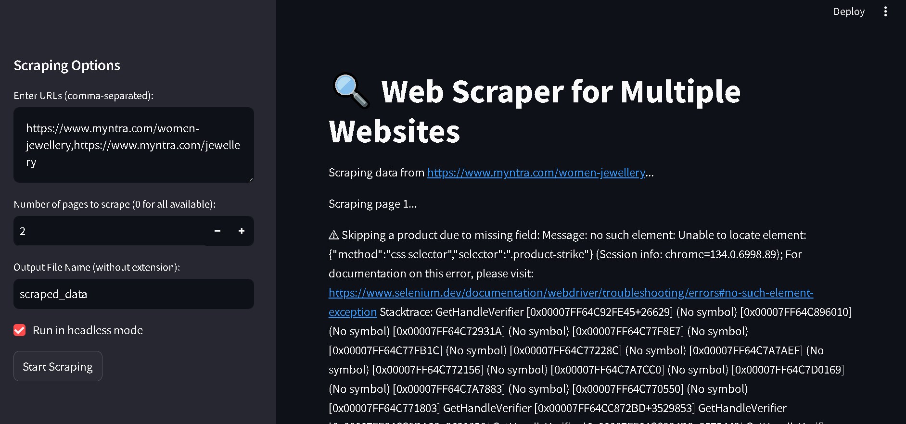
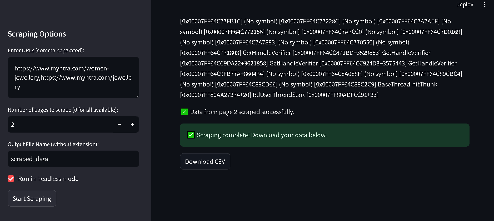

# Web Scraper for Multiple Websites




## 📌 Overview
This project is a **Streamlit-based web scraping application** that extracts product details from multiple e-commerce websites. The scraper uses **Selenium** to navigate pages, extract product information, and save the data into a CSV file for download.

## 🚀 Features
- **Scrape multiple URLs**: Enter multiple website URLs (comma-separated) for scraping.
- **Headless Mode**: Option to run the scraper in headless mode for better performance.
- **Pagination Support**: Scrape multiple pages from each URL until no more products are found.
- **Automatic CSV Export**: Save scraped data into a CSV file.
- **Error Handling**: Handles missing fields and timeout exceptions gracefully.

## 🛠 Requirements
Ensure you have the following installed before running the scraper:

- Python 3.10
- Google Chrome (latest version)
- Chrome WebDriver (matching your Chrome version)
- Required Python libraries:
  ```bash
  pip install streamlit pandas selenium
  ```

## 🔧 How to Run
1. **Clone the repository:**
   ```bash
   git clone https://github.com/PriyanshuDey23/Product-WebScraper.git
   cd web-scraper
   ```
2. **Install dependencies:**
   ```bash
   pip install -r requirements.txt
   ```
3. **Run the Streamlit application:**
   ```bash
   streamlit run app.py
   ```
4. **Use the Web Interface:**
   - Enter the URLs to scrape.
   - Set the number of pages to scrape (0 for all available pages).
   - Choose to enable/disable headless mode.
   - Click on "Start Scraping" to begin.
   - Download the CSV file when the scraping process is complete.

## 📂 Output Format
The scraped data is stored in a CSV file with the following fields:
| Brand | Name | Actual Price | Discounted Price | Discount Percentage | Rating | Product URL |
|--------|------|--------------|------------------|----------------------|--------|-------------|

## ⚠️ Notes
- **Ensure Chrome WebDriver is compatible** with your installed version of Chrome.
- The scraper may not work if the website updates its structure (e.g., class names change).
- Websites with CAPTCHAs or bot detection mechanisms may block automated scraping.

## 📜 License
This project is licensed under the MIT License. Feel free to modify and distribute it.

## 🤝 Contributing
If you want to improve this scraper, feel free to fork the repository and submit a pull request!

## 📞 Contact
For any issues or suggestions, reach out via GitHub issues.

